# Huawei Solar HEMS

Home Assistent (HA) **Home Energy Management System** (HEMS)

[![License][license-shield]](LICENSE) [![GitHub Last Commit][last-commit-shield]][commits] ![GitHub Stars][stars-shield] ![GitHub Watchers][watchers-shield] ![GitHub Forks][forks-shield]

[![Community Forum][forum-shield]][forum]

**Huawei Solar HEMS** assist you with **a set of custom** HA **template sensors**, **automations** and **dashboards** also referred to as the *"Huawei Solar HEMS package"*.

| Dashboard: Level 1                     |
|:--------------------------------------:|
| 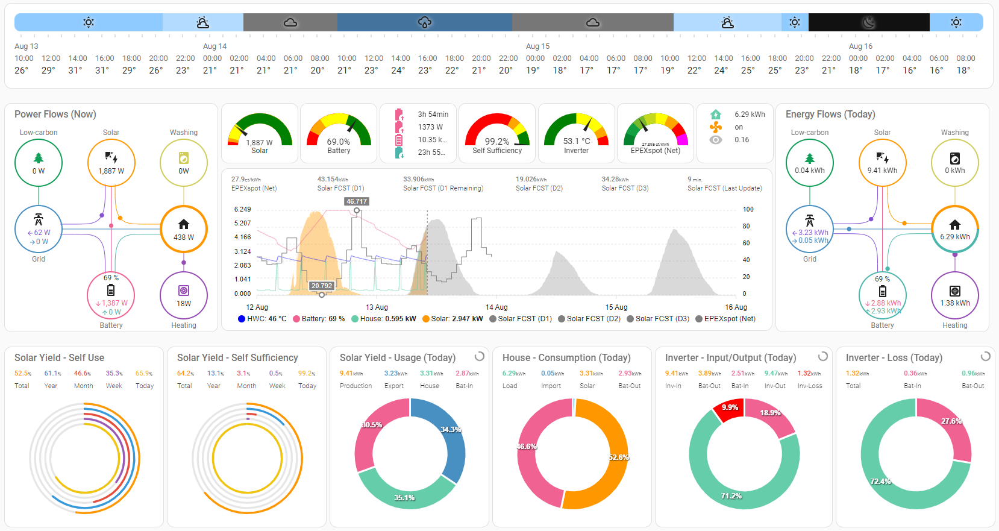 |

These custom sensors and automations calculate all the power and energy flows of your Huawei FusionSolar PV installation based on the sensors, services and information provided by [Huawei Solar Integration](https://github.com/wlcrs/huawei_solar), because this custom HA integration ONLY exposes the information and functions made available by Huawei Solar inverters directly via one of its Modbus interfaces, which is far away from enhanced requirements of an HEMS.

All custom template sensors and automations are available as HA package files or HA blueprints and all dashboards are available through HA YAML dashboards for an easy [Installation](#installation).
For an overview and a more detailed description of the custom sensors and automations, please refer to the [Huawei Solar HEMS Wiki Pages](https://github.com/heinemannj/huawei_solar_hems/wiki).

## Table of Contents

- [Additional HEMS features](#additional-hems-features)
  - [Forecasting](#forecasting)
  - [Monitoring](#monitoring)
  - [Tibber prices](#tibber-prices)
  - [Tibber consumption and costs](#tibber-consumption-and-costs)
- [Installation](#installation)
- [System setup](#system-setup)
  - [FusionSolar PV](#fusionsolar-pv)
  - [EM system and House load](#em-system-and-house-load)
- [FAQ - Troubleshooting](#faq---troubleshooting)

## Additional HEMS features

### Forecasting

| Dashboard: Level 2                     |
|:--------------------------------------:|
| 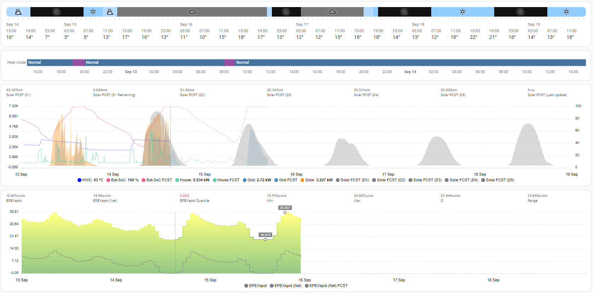 |

- **PV Solar forecasts** by the usage of [Solcast integration](https://github.com/BJReplay/ha-solcast-solar)
   This custom component integrates the [Solcast Hobby PV Forecast API](https://solcast.com/free-rooftop-solar-forecasting) into HA.
- **EPEX Spot electricity price forecasts** by the usage of [EPEXSpot integration](https://github.com/mampfes/ha_epex_spot)
   This custom component adds electricity prices from the European Power EXchange ( [EPEX Spot](https://www.epexspot.com/en/about) ) into HA.
   It covers Austria, Belgium, Denmark, Germany, Finland, France, Luxembourg, the Netherlands, Norway, Poland, Sweden, the United Kingdom and Switzerland at this time.
- **Hourly Weather forecasts**
- **House load and batteries SOC forecasts** by the usage of the [EMHASS Add-on](https://github.com/davidusb-geek/emhass-add-on)
   [EMHASS](https://github.com/davidusb-geek/emhass) (Energy Management for Home Assistant) is an optimization tool designed for residential households connected to HA.

### Monitoring

| Dashboard: Level 3                     |
|:--------------------------------------:|
|  |
  
### Tibber prices

| Dashboard: Level 4-1 - Today & tomorrow        | Dashboard: Level 4-2 - Past                    |
|:----------------------------------------------:|:----------------------------------------------:|
| 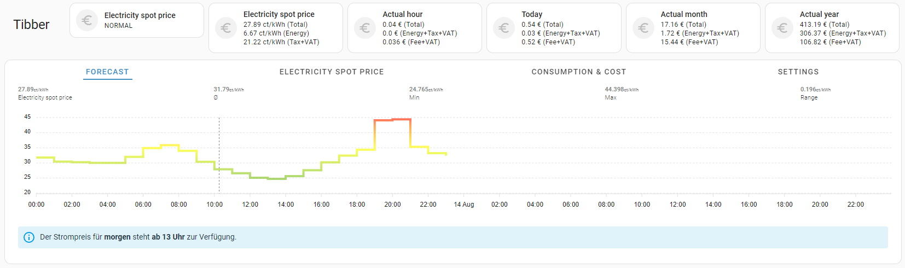     | 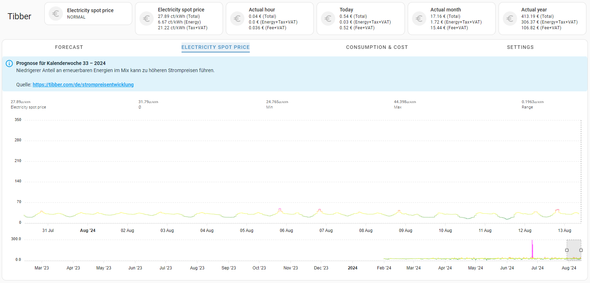     |

### Tibber consumption and costs

| Dashboard: Level 4-3-1 - Hourly                | Dashboard: Level 4-3-2 - Daily                 |
|:----------------------------------------------:|:----------------------------------------------:|
| 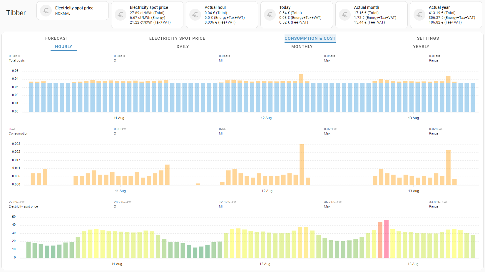 | 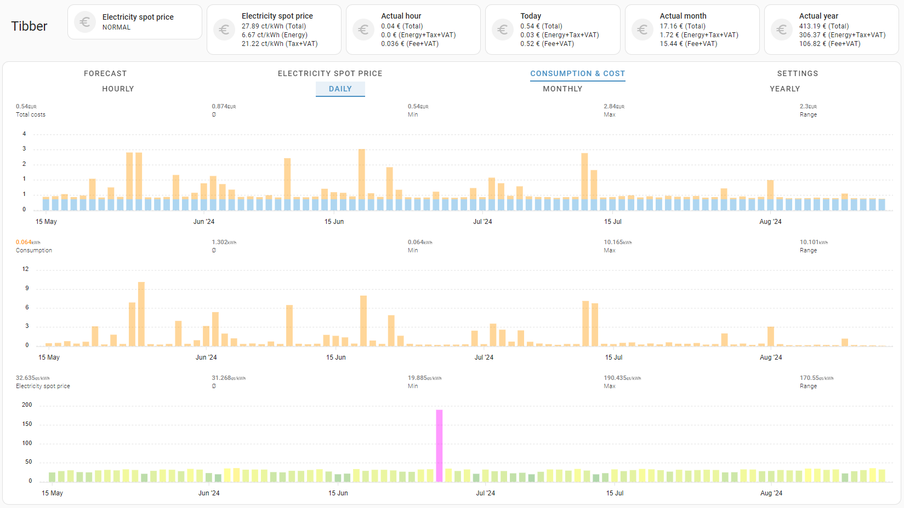 |

| Dashboard: Level 4-3-3 - Monthly               | Dashboard: Level 4-3-4 - Yearly                |
|:----------------------------------------------:|:----------------------------------------------:|
| 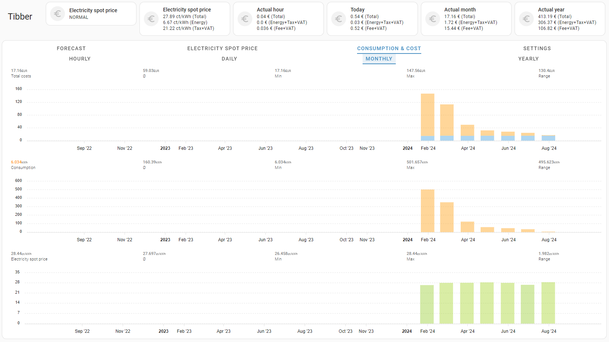 | 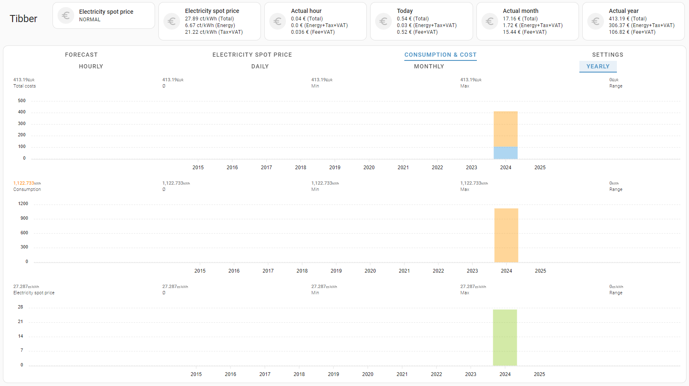 |

## Installation

For [installation](https://github.com/heinemannj/huawei_solar_hems/wiki/Installation) follow all [prerequisites and installation guides](https://github.com/heinemannj/huawei_solar_hems/wiki/Installation#prerequisites) strictly!

* **Step by step**.

## System setup

### FusionSolar PV

The provided custom sensors are based on a setup with **one** Huawei Smart Energy Controller (**Inverter**) and **multiple** Huawei Smart String ESS (**Batteries**):

| Dashboard: Level 5                     |
|:--------------------------------------:|
| 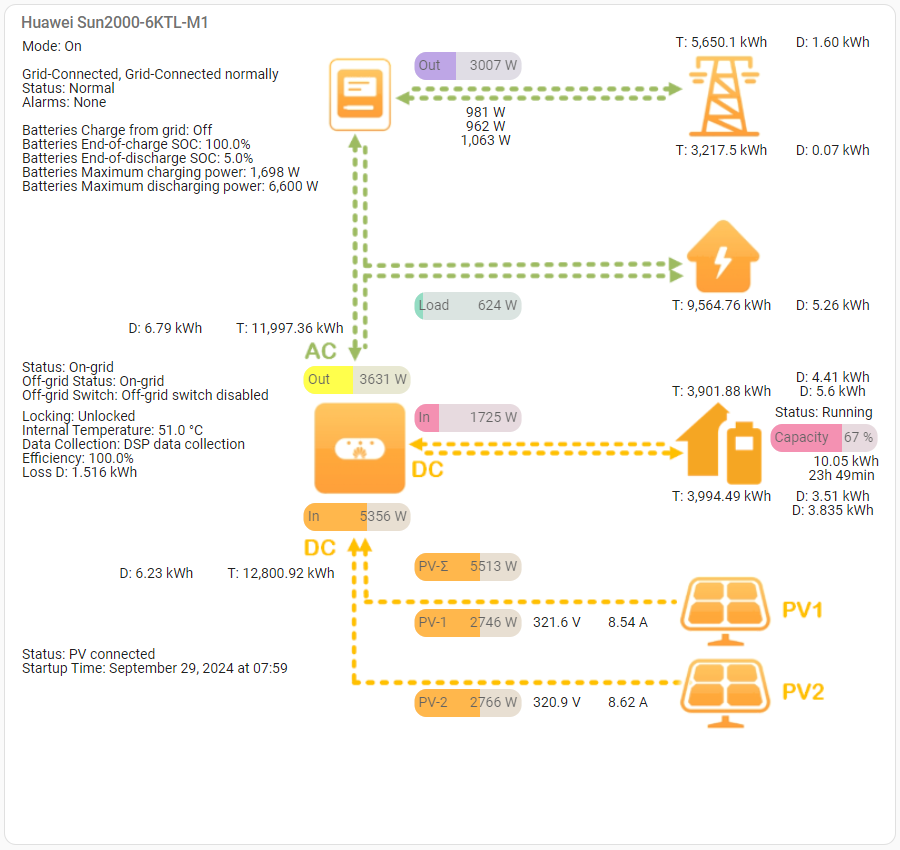 |

### EM system and House load

|PV system||
|:---|:---:|
|**PV strings** - **PV1**: 10 x 390 Wp = **3900 Wp** - **PV2**: 10 x 390 Wp = **3900 Wp** - **Full occupancy** of the south/east roof &#160;&#160;20 x Trina Vertex S TSM-390DE09.05 390 Wp = 7.8 kWp - Optimizers: No||
|**Azimuth** - Orientation of PV modules - [NOAA Solar Calculator](https://gml.noaa.gov/grad/solcalc/)|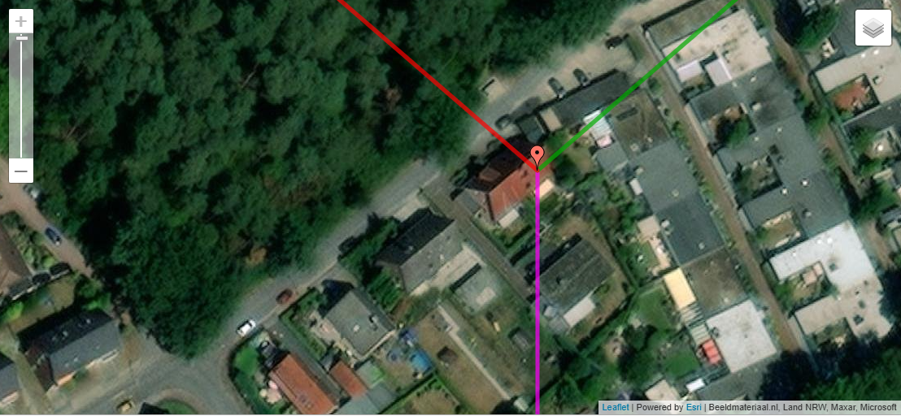|
|**Improvement** - Use **optimizers for all modules**  [Long String Design with Power Optimizer](https://assets.ctfassets.net/nh4y4z9oigt2/2lgFD2TEGsFWWCwZScAMRw/4c3e87c42d8e260daf14f156ccd2d23f/3_Upgrade_Your_Optimizer_Experience.pdf) **will increase the total number of modules per string** for expanding to the opposite side of the roof.|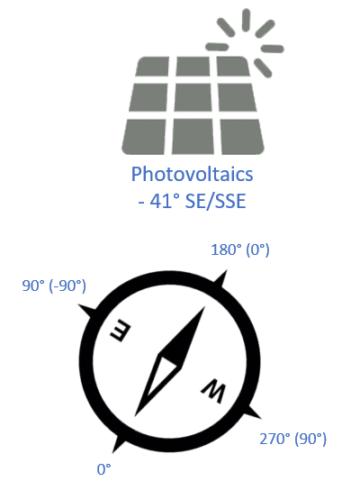|
|**Inverter** - Type: `SUN2000-6KTL-M1 (High Current)` - Firmware: V100R001C00SPC165 - MBUS Firmware: V100R001C00SPC335 - **Connect** to inverter: Via `SUN2000-<serial_no> WiFi`  **Batteries** - Battery-1: `LUNA2000-5KW-C0` - Battery-2: `LUNA2000-10KW-C0` - Firmware : V100R002C00SPC624||
|**Power meter** - Type: `Three phase`  **sDongle** - Type: sDongleA-05 (WiFi / Ethernet) - Connectivitiy: `Ethernet` - Firmware: V200R022C10SPC118  |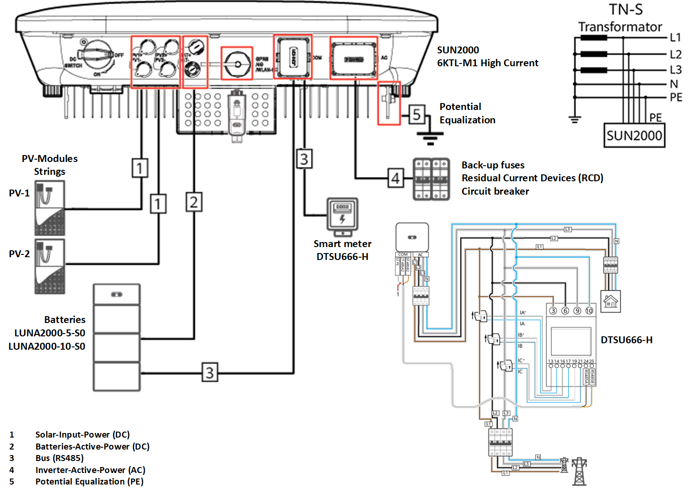|
|**Power distribution**||
|**Power flows**|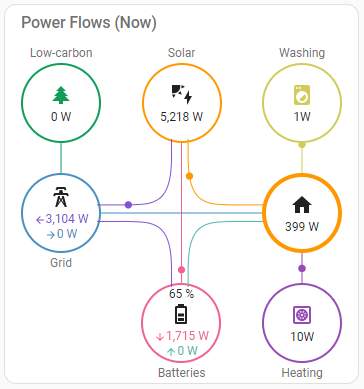|
|**Meter cabinet** - Back-up fuses - Surge protection - Residual Current Devices (RCD) - Circuit breaker  - [Documentation](assets/meter-cabinet-documentation.pdf)  **Wallbox** - Wiring and fuses for future use.||
|||
|**Energy measurement**||
|**Energy flows**|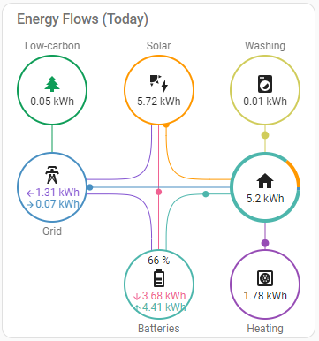|
|**Smart meter** - HUAWEI Smart Power Sensor DTSU666-H 100A/50mA||
||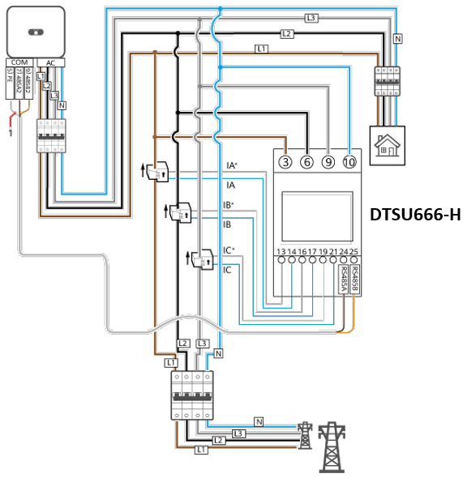|
|**Connect** to inverters MBUS - [Via `SUN2000-<serial_no> WiFi`](https://github.com/wlcrs/huawei_solar/wiki/Connecting-to-the-inverter#connect-to-the-inverter-ap-sun2000-serial_no-wifi)|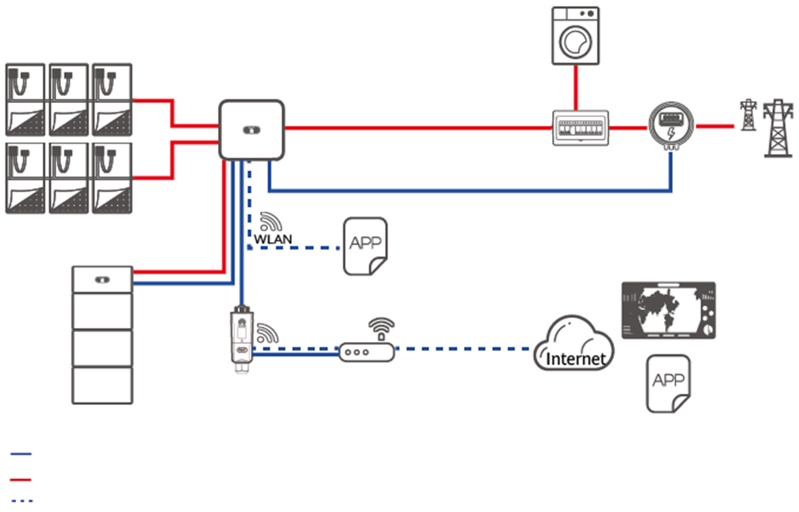|
|**Tibber Pulse** - 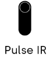 - 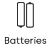|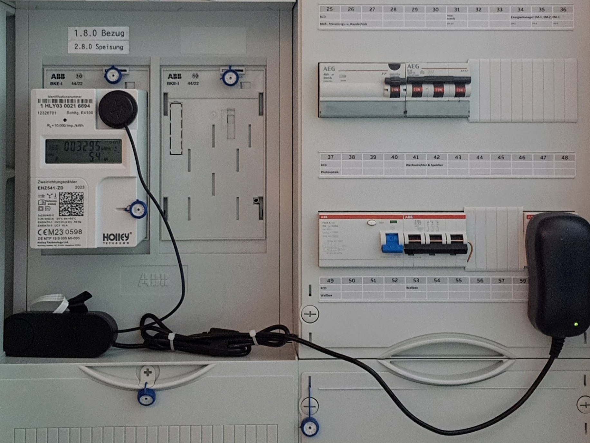|
|- 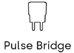|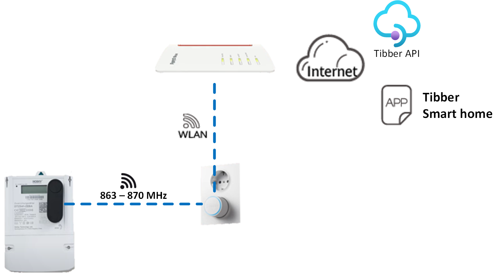|
|**Three-phase energy meters** - 3 x Shelly Pro 3EM - 120A||
||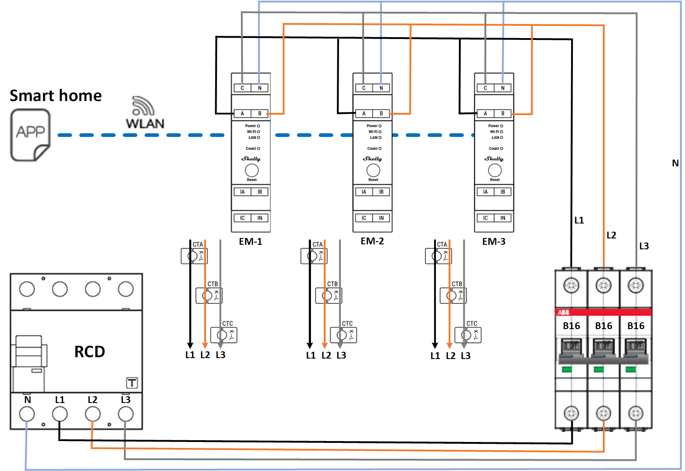|
|**Energy management**||
|**Heat Pump Smart Grid Ready controller**  - 2 x Shelly Plus 1 &#160;&#160;SG-Ready Heat Pump Lock switch (HP Terminal 1) &#160;&#160;SG-Ready PV Excess switch (HP Terminal 2)  **eBUS controller** - [eBUS Adapter Shield v5](https://adapter.ebusd.eu/)||
|- [SG-/PV-Ready Documentation](assets/Installation-Manual-PV-Ready-aroTherm-Plus.pdf)||

## Notes

* Alpha version at this stage.
  * Especially the persistant template sensors and all automations should be validated by the community.
  * Not for HA beginners, but hopefully our **community will help** ...
* In my environment [Wife Acceptance Factor](https://en.wikipedia.org/wiki/Wife_acceptance_factor) (WAF) is strongly increasing - **Save your money to have more fun** ;-)
* **Save our earth** and **protect** next generations of **our children**!
* **Think long term** and **do the needful**.

Already opened Discussion: [Huawei Solar Discussion > Dashboard #355](https://github.com/wlcrs/huawei_solar/discussions/355)

- Private information is stored in secrets.yaml (not uploaded).

## FAQ - Troubleshooting

**Q**: What are the minimum hardware requirements for the Home Assistant (HA) server in relation to HEMS features?

**A**: I started my HEMS development journey on a Raspberry Pi 4b with 8GB RAM. This hardware level is sufficient for testing purposes. For production, it is highly recommended to upgrade your HA to a [Mini PC server](https://github.com/heinemannj/huawei_solar_hems/wiki/Environment#mini-pc-server). 

---

**Q**: I don't use Tibber. Can I use the other HEMS functions?

**A**: Yes you can. Simply comment out Tibber related entries in
* `<config>/configuration.yaml` and in
* `<config>/dashboards/420-pv/index.yaml` the line 
  * `- !include /config/dashboards/420-pv/views/424-pv.yaml`.

---
[commits-shield]: https://img.shields.io/github/commit-activity/y/heinemannj/huawei_solar_hems.svg
[commits]: https://github.com/heinemannj/huawei_solar_hems/commits/master
[actions-shield]: https://github.com/heinemannj/huawei_solar_hems/workflows/Home%20Assistant%20CI/badge.svg
[actions]: https://github.com/heinemannj/huawei_solar_hems/actions
[contributors]: https://github.com/heinemannj/huawei_solar_hems/graphs/contributors
[discord-shield]: https://img.shields.io/discord/330944238910963714.svg
[discord]: https://discord.gg/c5DvZ4e
[forum-shield]: https://img.shields.io/badge/community-forum-brightgreen.svg
[forum]: https://community.home-assistant.io/?u=heinemannj
[heinemannj]: https://github.com/heinemannj
[travis-shield]: https://travis-ci.org/heinemannj/huawei_solar_hems.svg?branch=master
[travis]: https://travis-ci.org/heinemannj/huawei_solar_hems
[home-assistant]: https://home-assistant.io
[issue]: https://github.com/heinemannj/huawei_solar_hems/issues
[license-shield]: https://img.shields.io/badge/license-MIT-green.svg
[maintenance-shield]: https://img.shields.io/maintenance/yes/2023.svg
[last-commit-shield]: https://img.shields.io/github/last-commit/heinemannj/huawei_solar_hems.svg
[stars-shield]: https://img.shields.io/github/stars/heinemannj/huawei_solar_hems.svg?style=social&label=Stars
[forks-shield]: https://img.shields.io/github/forks/heinemannj/huawei_solar_hems.svg?style=social&label=Forks
[watchers-shield]: https://img.shields.io/github/watchers/heinemannj/huawei_solar_hems.svg?style=social&label=Watchers
[black-duck-shield]: https://copilot.blackducksoftware.com/github/repos/heinemannj/huawei_solar_hems/branches/master/badge-risk.svg
[black-duck]: https://copilot.blackducksoftware.com/github/repos/heinemannj/huawei_solar_hems/branches/master/
